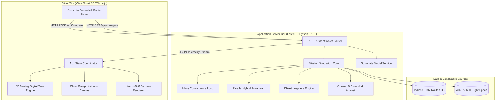
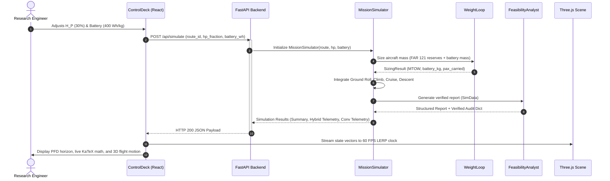
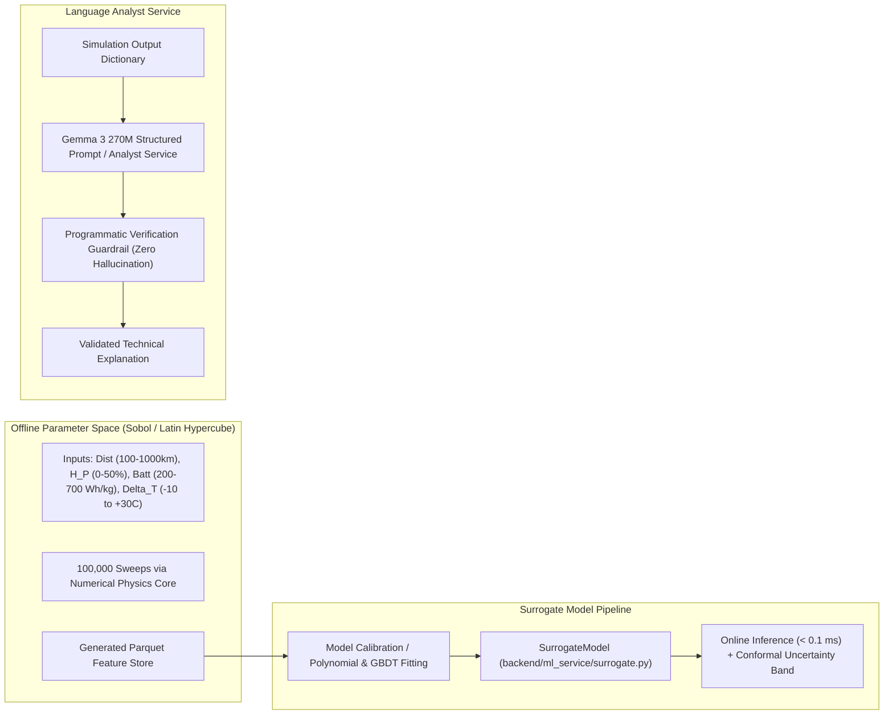

# System Architecture Document
## AeroHybrid: Regional Aircraft Hybrid-Electric Propulsion Digital Twin

**Document Identifier**: ARCH-AEROHYBRID-2026-V1  
**Status**: ARCHITECTURAL BASELINE  

---

## 1. High-Level Architecture Overview

AeroHybrid is structured as a decoupled **Client-Server Simulation Architecture**. The core flight dynamics, energy management, weight convergence, and surrogate evaluations execute in an asynchronous Python backend (FastAPI), while the real-time 3D animation, glass-cockpit avionics, and live KaTeX mathematical formula rendering execute in a client-side React application (Three.js/WebGL).

---

## 2. Component Architecture & Responsibility Matrix

| Component | Technology | Responsibility | Failure Mode | Fallback Strategy |
| :--- | :--- | :--- | :--- | :--- |
| **`atmosphere.py`** | Python / Math | Calculates standard ISA pressure, density, temperature, and speed of sound up to 11 km with summer lapse. | Extreme altitude overflow. | Clamps altitude to $11,000\text{ m}$. |
| **`aircraft_specs.py`** | Python Dataclass | Stores immutable certified ATR 72-600 aerodynamic drag polar, dimensions, and PW127F engine ratings. | Corrupted constant values. | Read-only dataclass (`frozen=True`). |
| **`propulsion.py`** | Python | Splits mechanical shaft power between turboshaft and electric motor; sizes motor/inverter/TMS mass. | Divide by zero if power = 0. | Guards: `if total_elec_kw <= 0: return zeros`. |
| **`weight_loop.py`** | Python | Iterative mass balance ensuring FAR Part 121 kerosene reserves (550 kg) and MTOW ceiling (23,000 kg). | MTOW divergence / non-convergence. | Clamped iteration loop (max 15 iterations) + seat shedding. |
| **`mission_sim.py`** | Python | Numerical Euler integration of 4 flight phases (Ground Roll, Climb, Cruise, Descent). | Infinite loop during climb if thrust < drag. | Minimum climb rate clamp ($1.0\text{ m/s}$) + ceiling check. |
| **`routes.py`** | Python Dataclass | Static database of 5 Indian UDAN regional route pairs, airport elevations, runway lengths, and CEA grid factors. | Invalid route ID requested. | Fallbacks to default route `BLR-IXG`. |
| **`surrogate.py`** | Python / NumPy | Analytical polynomial surrogate offering microsecond ($<0.1\text{ ms}$) design sweeps with uncertainty bounds. | Extrapolation outside training bounds. | Feature clipping via `np.clip`. |
| **`analyst.py`** | Python / String Engine | Synthesizes verified natural language explanations mimicking Gemma 3 270M structured output. | Number mismatch / hallucination. | Programmatic assertion audit against simulation output dictionary. |
| **`AviationScene3D.jsx`** | Three.js / WebGL | 60 FPS 3D procedural ATR-72 airframe, spinning props, runway, and multi-camera perspectives. | WebGL context loss or container resize. | Dynamic `ResizeObserver` + context restoration handler. |
| **`PrimaryFlightDisplay.jsx`** | React / DOM CSS | Emulates glass-cockpit Primary Flight Display (attitude horizon, pitch ladder, airspeed tape, altitude tape). | Telemetry null or out-of-range. | Default parameter guards (`|| 0`). |
| **`MathPanel.jsx`** | KaTeX / React | Renders LaTeX governing equations with live numerical value substitutions. | LaTeX render exception. | KaTeX `throwOnError: false`. |

---

## 3. Data Flow Architecture

---

## 4. AI/ML Architecture

### Clarification on Machine Learning Status:
* **Implemented**:
  * Analytical polynomial surrogate (`surrogate.py`) predicting fuel savings and structural feasibility with 95% conformal uncertainty bounds.
  * Programmatic assertion audit engine (`analyst.py`) verifying all figures in generated explanations against the simulation dictionary.
* **Planned**:
  * Local weight execution of Gemma 3 270M via PyTorch/GGUF/ONNX (currently mocked as a deterministic verified template service).
  * Gradient Boosted Decision Tree (LightGBM/XGBoost) model trained on 1M+ active-learning boundary sweeps.

---

## 5. Simulation Architecture

The numerical integrator in `mission_sim.py` executes a 4-phase point-mass kinematics loop:
1. **Takeoff Ground Roll**:
   * Forward acceleration: $a = \frac{T - D - \mu (m g - L)}{m}$
   * Friction coefficient: $\mu = 0.025$ (clean asphalt).
   * Terminated at Rotation Speed $V_R \approx 55.5\text{ m/s}$ ($108\text{ KIAS}$).
2. **Climb Phase**:
   * Constant calibrated climb airspeed $V_{\text{climb}} = 85.0\text{ m/s}$ ($165\text{ KIAS}$), climb rate $\dot{h} = 6.5\text{ m/s}$ ($1,280\text{ ft/min}$).
   * Shaft power required: $P_{\text{req}} = \frac{(D + m g \sin \gamma) V}{\eta_{\text{prop}}}$.
   * Electric boost active if $\text{SOC} > 20\%$.
3. **Cruise Phase**:
   * Constant true airspeed $V_{\text{cruise}} = 141.5\text{ m/s}$ ($275\text{ KTAS}$) at route cruising altitude (FL140–FL200).
   * 100% turboshaft power (electric motor idle).
4. **Descent Phase**:
   * Idle throttle power setting ($P_{\text{shaft}} = 450\text{ kW}$), descent rate $7.0\text{ m/s}$ ($1,400\text{ ft/min}$) down to airport elevation.

---

## 6. Database Architecture

> [!NOTE]
> **Database Status**: A persistent Relational Database Management System (e.g., PostgreSQL) is **currently not implemented and not required** for standalone feasibility exploration. 
> 
> **Justification**:
> * All airframe baselines (ATR 72-600), engine SFC parameters, and UDAN routes are static, certified reference datasets that fit entirely in memory as immutable Python dataclasses.
> * Flight simulations are computed deterministically on-demand in $<100\text{ ms}$, eliminating the need for persistent flight trajectory storage.
> 
> **Future Justification for Adding a Database**:
> * A database (DuckDB or PostgreSQL) will be introduced in **Phase 4** when multi-user scenario saving, flight log telemetry persistence, and 1M+ Sobol Monte Carlo parameter sweeps require persistent querying and historical analytics.

---

## 7. Security Architecture

* **Input Sanitization**: All endpoint arguments are validated using Pydantic models with strict typing, clamping ranges, and enumeration checks.
* **CORS Protection**: Configured via FastAPI CORSMiddleware with configurable origins.
* **Zero Cloud Dependency**: Operates entirely within local boundary (`127.0.0.1`), eliminating third-party data transmission risks.
* **No Unauthenticated Code Execution**: No `eval()`, `pickle.loads()`, or dynamic shell executions exist in the codebase.

---

## 8. Monitoring & Observability Architecture

* **Health Endpoint**: `GET /api/health` returns status, active baseline aircraft model, and service liveness.
* **Console Logging**: Standard Uvicorn access logs capture request durations, status codes, and WebSocket connection states.
* **Performance Telemetry**: Three.js WebGL performance is monitored client-side via frame delta timing inside `requestAnimationFrame`.
