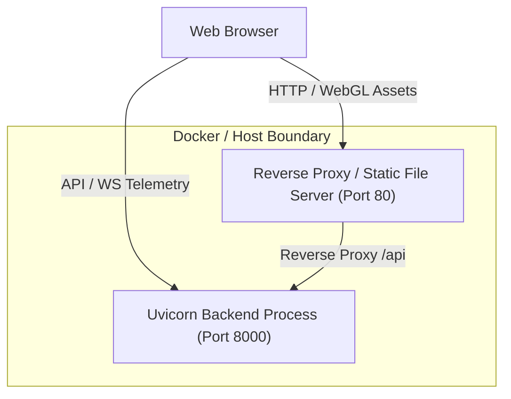

# Production Deployment Specification & Infrastructure Guide
## AeroHybrid Platform Containerization & Service Orchestration

**Document Identifier**: DEP-AEROHYBRID-2026-V1  
**Status**: ACTIVE DEPLOYMENT GUIDE  

---

## 1. Deployment Architecture Overview

AeroHybrid is architected to run either as a lightweight local development environment or as a containerized dual-service stack orchestrated via Docker Compose:



---

## 2. Docker Multi-Stage Containerization

### 2.1 Backend Dockerfile (`backend/Dockerfile`)
```dockerfile
FROM python:3.11-slim AS backend

WORKDIR /app

# Install system dependencies
RUN apt-get update && apt-get install -y --no-install-recommends \
    build-essential \
    && rm -rf /var/lib/apt/lists/*

COPY requirements.txt .
RUN pip install --no-cache-dir -r requirements.txt

COPY backend/ ./backend/

EXPOSE 8000

CMD ["uvicorn", "backend.app:app", "--host", "0.0.0.0", "--port", "8000"]
```

### 2.2 Docker Compose (`docker-compose.yml`)
```yaml
version: '3.8'

services:
  backend:
    build:
      context: .
      dockerfile: backend/Dockerfile
    ports:
      - "8000:8000"
    environment:
      - PYTHONUNBUFFERED=1
      - CORS_ORIGINS=*
    healthcheck:
      test: ["CMD", "python", "-c", "import urllib.request; urllib.request.urlopen('http://127.0.0.1:8000/api/health')"]
      interval: 15s
      timeout: 5s
      retries: 3
    restart: unless-stopped

  frontend:
    image: node:20-alpine
    working_dir: /app
    volumes:
      - ./frontend:/app
    ports:
      - "5173:5173"
    command: sh -c "npm install && npm run dev -- --host 0.0.0.0 --port 5173"
    depends_on:
      backend:
        condition: service_healthy
    restart: unless-stopped
```

---

## 3. Environment Variables Reference

| Variable Name | Default Value | Allowed Values | Description |
| :--- | :---: | :---: | :--- |
| `AEROHYBRID_PORT` | `8000` | Integer | Port for FastAPI backend service. |
| `AEROHYBRID_HOST` | `127.0.0.1` | IP String | Host interface binding (`0.0.0.0` for Docker). |
| `CORS_ORIGINS` | `*` | Comma-separated | Permitted CORS origins. |
| `MAX_WORKERS` | `1` | Integer | Uvicorn worker threads (simulation is in-memory CPU-bound). |

---

## 4. Operational Health Checks & Monitoring

* **Liveness Probe**:
  * Endpoint: `GET /api/health`
  * Expected Response: HTTP 200 `{"status":"online","model":"ATR-72-600 Parallel Hybrid"}`
* **Process Monitoring**:
  * CPU and memory usage can be monitored via standard Docker stats (`docker stats`).
  * Expected memory consumption: $\le 120\text{ MB}$ for backend, $\le 80\text{ MB}$ for frontend static serving.
